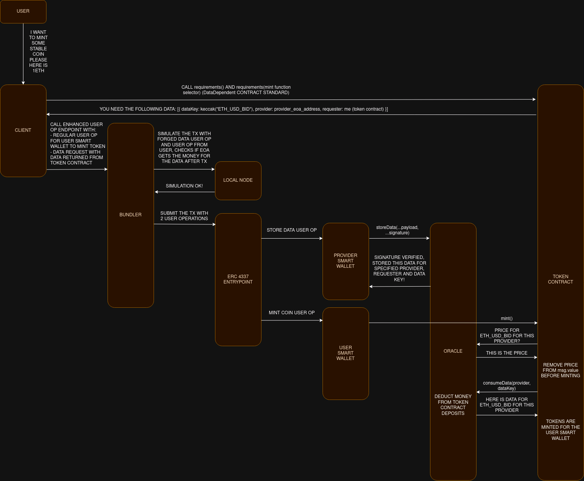

# Morpher ERC-4337 Data Oracle

This is the central repository for the Morpher ERC-3447 Data Oracle. The repository contains the protocol smart contracts, as well as the bundler and sdk projects.

## Protocol overview

The protocol is strongly based on the ERC-4337 account abstraction. The fundamental idea is that any time a user operation needs oracle data to be executed, the bundler provides the data including another user operation in the same bundle.

## The Oracle Entrypoint

The Oracle Entrypoint is a singleton contract responsible for validating the oracle data and manage the economics of the protocol. The two main functions of the Entrypoints are `storeData` and `consumeData`. The former is called by the bundler to store the data into the Entrypoint using a signed payload, the latter is called by any data-dependent contract (see Data Dependency) and provides the requested data to that contract after a fee is paid (to the bundler).

## Data Dependency

Any contract needing oracle data provided with the use of the protocol, must implement the `DataDependent` interface. This is needed to provide information about the needed data to the client which is creating the user operation for the end user.

## Bundler

The bundler has to run a modified version of the [Voltaire Bundler](https://github.com/candidelabs/voltaire). For more details, see the [submodule](https://github.com/Morpher-io/dd-voltaire).

## SDK

To create and send user operations to the bundler, we provide a modified version of the [AbstractionKit](https://github.com/candidelabs/abstractionkit). For more details, see the [submodule](https://github.com/Morpher-io/dd-abstractionkit).

## Example

This is an example usage of the protocol by a stablecoin smart contract.

The end user is interacting with the client, which is using the modified AbstractionKit.
The client is fetching the Data Requirements from the contract and creating a data-dependent user operation, using the modified bundler to get gas limits estimation.
After the operation is sent to the bundler, the latter is responsible for checking that the user operation is not reverting and that is actually consuming the data.
Now that the bundler has verified that the fee is going to get paid, it includes the new user operation calling `storeData` in the bundle and send it to the ERC-4337 entrypoint. In the end, within a single transaction, the data is stored and consumed and the end user is able to mint the chosen amount of the stable coin.

## Further Work

With the current version of the protocol, an entity creating a data-dependent contract has to pick a data provider (which is running a bundler) to get their data from. Since only that bundler can sign the data with the private key, the functionality of the contract will be entirely dependent on one single entity (the bundler) to behave honestly and not malfunctioning.
The coming version will create a p2p channel between bundlers, so that a data request can be broadcasted and a single bundler will be able to include other bundlers' user operations. In this way, a data-dependent contract will have the possibility decide to get data from multiple providers and decide how to aggregate that data, making the protocol completely decentralized.
